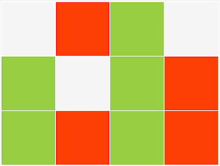
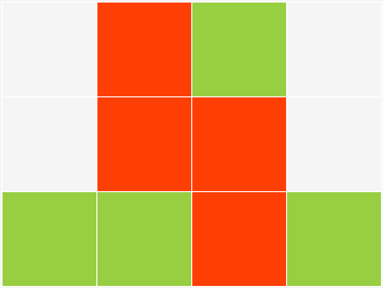

# :clock10: Ternary clock with colorful read-out (web-version)
 
## What

At school, kids learn to count from 1 to 10 (probably because of the number of fingers on your hands ;-). As such, in daily life, the decimal system is by far the most popular, and most intuitive to use. Computer scientists tend to prefer [binary](https://en.wikipedia.org/wiki/Binary_number) (0-1) or [hexadecimal](https://en.wikipedia.org/wiki/Hexadecimal) (x0-xF) systems. All of them are just a way of representing quantity (or whatever info you want) in a non-ambiguous way.

In a [ternary or base-3 systems](https://en.wikipedia.org/wiki/Ternary_numeral_system), only 0,1 and 2 are used. Being way less common, reading figures like 12201211 might make your brain-processor to get hot. The clock in this repository shows time by colored squares which represent the three possible states in a ternary numeral system.

Below you can find two static screenshots. In order to see a fully functional demo, either open the clock.html file in the [source folder](source/), or click on [this link to our server](http://nostradomus.ddns.net/clock.html).

`21:32:50`|`21:24:43`
----------|----------
 | 

If you are more of the building type, you might also be interested in the hardware version of our clock, to be found in [this related repository](https://github.com/nostradomus/Base3-clock).

## Why

Some might find the idea a little crazy, others will say its fun. I think it is an excellent tool to train the brain... and I am probably having a twisted mind :laughing:

Anyhow, it was a good exercise to write some javascript, it's a challenge every time you want to know the time, and it was great fun after all.

## How

The logic has been written in javascript, and all of it has been integrated in a minimalistic webpage in order to have a universal interface. In its current configuration the result even renders nicely on a smartphone (oriented in landscape).

## Technical details

### How to read the clock

Each square represents one base-3 digit, with a different color for each possible value :
 - 0 : `gray`
 - 1 : `green`
 - 2 : `red`

Each line represents a part of the time :

line | description | values
-----|-------------|-------
1 | hours | 00-23
2 | minutes | 00-59
3 | seconds | 00-59

The numbers should be read from right to left.

The rightmost square is the least significant trit (yes trit, not bit).

The leftmost square is the most significant trit.

### Maths

The same way binary or decimal numeral systems are based on powers of their respective radices 2 and 10, the **ternary** system is based on powers of `3`.

trit    | least significant |       |        |         |          | ... | most significant
--------|-------------------|-------|--------|---------|----------|-----|-----------------
power   | 0                 | 1     | 2      | 3       | 4        | ... |
decimal | 1                 | 3     | 9      | 27      | 81       | ... |
range   | 0/1/2             | 0/3/6 | 0/9/18 | 0/27/54 | 0/81/162 | ... |

So to convert a ternary number to the decimal system, you have to start with the rightmost digit, multiply it with 3^0, multiply the next digit with 3^1, 3^2, and so on...

So for example (11021)ter = 1x3^0 + 2x3^1 + 0x3^2 + 1x3^3 + 1x3^4 =  (111)dec

The ternary numbers for the clock will have maximum 4 digits (max 3 for the hours).
 - `hours` : (000)ter - (222)ter => (0)dec - (26)dec
 - `mins/secs` : (0000)ter - (2222)ter => (0)dec - (80)dec

### Javascript sourcecode

The first function converts a decimal value into an array of color-names. Each element represents one trit. The array is limited to 4 elements, as the highest value for this application is 59 (minutes or seconds). Element 0 of the array contains the most significant trit, element 3 the least significant. The trit value is obtained by dividing the decimal value by powers of 3, and translating the remainder to the respective html-color for the trit value :
 - 0 : `whitesmoke`
 - 1 : `yellowgreen`
 - 2 : `orangered`

```javascript
  function convertToTernaryColors(decimal) {
    var ternaryColors = ["whitesmoke", "whitesmoke", "whitesmoke", "whitesmoke"];
    var div;
    var rem;
    for (i = 0; i < 4; i++) {
        div = Math.floor(decimal/Math.pow(3, 3-i));
        rem = decimal % Math.pow(3, 3-i);
        switch(div) {
            case 1:
                ternaryColors[i] = "yellowgreen";
                break;
            case 2:
                ternaryColors[i] = "orangered";
                break;
          }
        decimal = rem;
      }
    return ternaryColors
  }
```
The second function takes care of the cyclic (every second) update of the time in the browser window. First of all a reference to the cells in the table is created. Variable x points to a 12-element array (3 x 4 digits, to compose hours, minutes and seconds). Next, the script gets the current timestamp from its host (your computer, tablet, smartphone...). Then, every time-element is having its ternary equivalent calculated by calling the first function. Last, the color-property is pushed to all respective cells (waiting for your Einstein brain to try reading it ;-).
```javascript
  function refreshClock() {
      /* get a reference to the table containing the digits                        */
      var x = document.getElementById("timetable").getElementsByTagName("td");

      /* get the current timestamp from the local machine                          */
      var date = new Date;
      var seconds = date.getSeconds();
      var minutes = date.getMinutes();
      var hour = date.getHours();

      /* convert hours/minutes/seconds to their ternary representation             */
      var ternaryHour = convertToTernaryColors(hour);
      var ternaryMinutes = convertToTernaryColors(minutes);
      var ternarySeconds = convertToTernaryColors(seconds);

      /* update the coloured squares in the table                                  */
      for (i = 0; i < 4; i++) {
        x[i].style.backgroundColor = ternaryHour[i];
        }
      for (i = 0; i < 4; i++) {
        x[i+4].style.backgroundColor = ternaryMinutes[i];
        }
      for (i = 0; i < 4; i++) {
        x[i+8].style.backgroundColor = ternarySeconds[i];
        }
  }
```

### CSS stylesheet

The stylesheet contains three types of important information.
 - The easy one to start with are the colors. ``whitesmoke`` is the default, or zero color for the digits, which is also used for the general background of the webpage. ``white`` is only used to create 1-pixel wide gridlines around the digits (ie. the table).
 - Next, in ``td.trit``, the ``height`` and ``width`` of the digits has been set to 100 pixels. Square digits rendered very well in this layout, but rectangular shapes will function the same way. However, when changing the height of the digit, it might be necessary to adapt the ``height`` in ``.center`` as well. This value should be 3 times the digit's height, plus 2 times the top margin.
 - Last but not least concerns the tricks to center the clock in your webpage. The definitions in ``.center`` will help creating an outer container which takes the full width of the window (without menus, toolbars, scrollbars...), and the ``height`` as defined in pixels. The ``.center table`` block will position our clock table in the middle of this container (horizontally and vertically centered). As the ``transform`` function is not rendered the same way in all browsers, it might be necessary to add extra lines with specific prefixes. I have added the ``-webkit-transform`` for use with safari on Mac OS X. When adding other ``transform`` lines with prefix, make sure that they proceed the general CSS ``transform``.

```css
/* definitions to create a 400-pixel high container using full browser width      */
.center
    {
    height: 400px;
    position: relative;
    }
/* put the table in the middle of the container horizontally and vertically       */
.center table
    {
    position: absolute;
    top: 50%;
    left: 50%;
    -webkit-transform: translate(-50%, -50%);
    -ms-transform: translate(-50%, -50%);
    transform: translate(-50%, -50%);
    }
/* set the background of the webpage to whitesmoke                                */
body
    {
    background-color: whitesmoke;
    }
/* set the table background to white, to show gridlines                           */
table.clock
    {
    background-color: white;
    }
/* set the size of the square representing a digit
   set the digit by default to whitesmoke, meaning value=0                        */
td.trit
    {
    background-color: whitesmoke;
    height: 100px;
    width: 100px;
    }
```

### HTML code

The HTML code which goes along with this project is pretty straightforward. The ``<head>`` part contains links to the above [javascript](#javascript-sourcecode) and [CSS](#css-stylesheet) files where all the magic happens. The ``onload`` keyword in the ``<body>`` tag tells your browser to update the clock every second, by calling the ``refreshClock`` function in the [javascript file](#javascript-sourcecode). Next, a ``div`` is set up as outer container to center the clock ``<table>``. All ``<td>`` cells start with the same properties. Their background color will be updated by the ``refreshClock`` function. Inside a table, cells can be addressed as an array. They are numbered from left to right, and from top to bottom. So, top-left is the first element of the array ``x[0]``, and bottom-right is the last element.

```html
<!DOCTYPE html>
<html lang="en">
    <head>
        <meta charset="UTF-8">
        <title>Ternary clock</title>                              
        <link href="clock.css" rel="stylesheet" type="text/css">   
        <script type="text/javascript" src="clock.js"></script>    
    </head>
    <body onload="window.setInterval(refreshClock, 1000)">        
        <div class="center">                                      
            <table class = "clock" id = "timetable">             
              <tr>
                <td class = "trit"><br /> </td>
                <td class = "trit"><br /> </td>
                <td class = "trit"><br /> </td>
                <td class = "trit"><br /> </td>
              </tr>
              <tr>
                <td class = "trit"><br /> </td>
                <td class = "trit"><br /> </td>
                <td class = "trit"><br /> </td>
                <td class = "trit"><br /> </td>
              </tr>
              <tr>
                <td class = "trit"><br /> </td>
                <td class = "trit"><br /> </td>
                <td class = "trit"><br /> </td>
                <td class = "trit"><br /> </td>
              </tr>
            </table>
        </div>
    </body>
</html>
```

## Contributors

If you are having any good suggestions, just drop me a line [:email:](http://nostradomus.ddns.net/contactform.html).
If feasible, I'll be happy to implement proposed improvements.
And if you are having lots of time, I'll be happy to share the work with you ;-).

When you create your own version, don't forget to send us a nice screenshot, or a link to your implementation. We'll be happy to publish it in the :confetti_ball:Hall of Fame:confetti_ball:.

## :globe_with_meridians: License

At this moment, there is no specific license attached to this project.

So, today, if you like it, have fun with it (at your own risk of course :-D), and especially, be creative.

Oh, and when using anything from this repository, it is highly appreciated if you mention its origin.

If you would like to use any of this work (or the whole project) for commercial use, first [contact us :email:](http://nostradomus.ddns.net/contactform.html), so we can add the appropriate license, which best fits your business.
